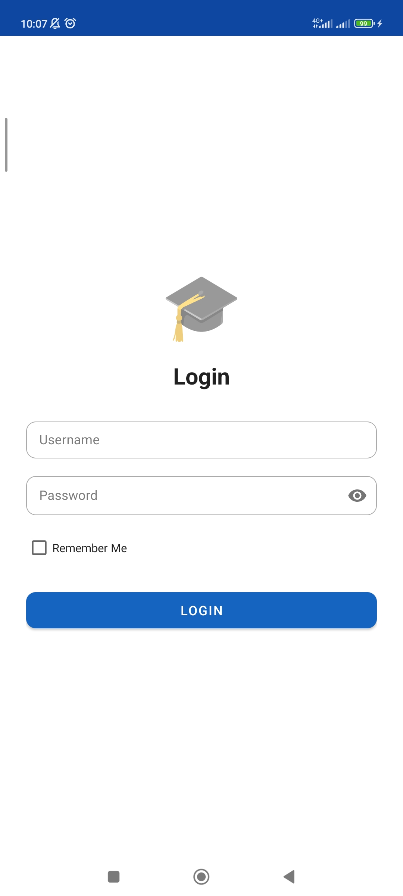
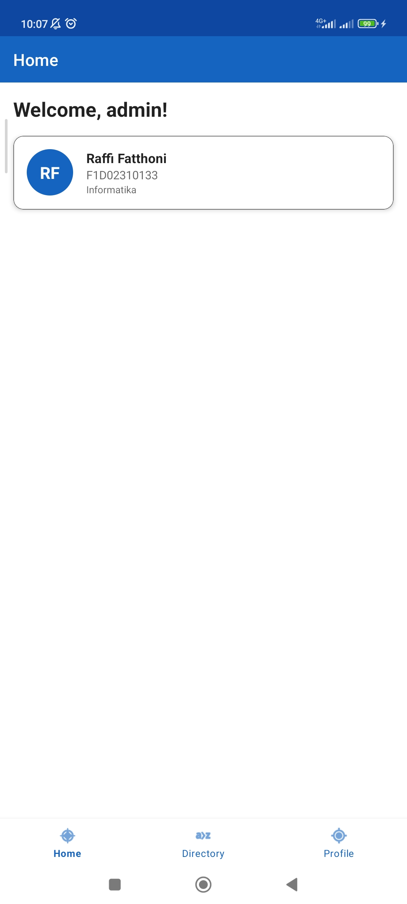
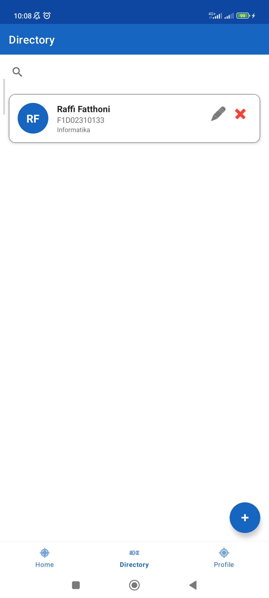
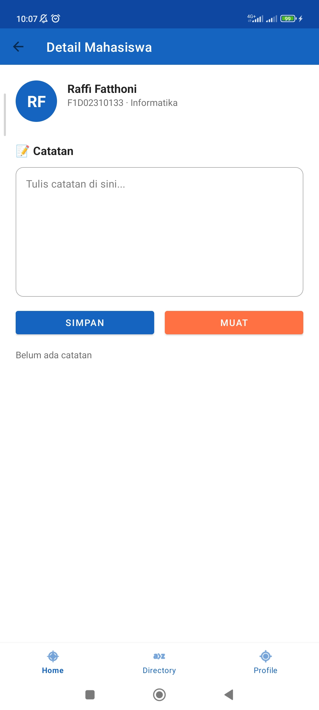
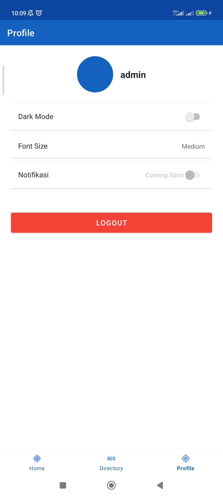

# Student Contact App

<pre>
Nama       : Raffi Fatthoni
NIM        : F1D02310133
Mata Kuliah: Mobile C
</pre>

## Deskripsi
Student Contact App adalah aplikasi manajemen data mahasiswa yang mengimplementasikan tiga metode penyimpanan data di Android: **SharedPreferences**, **Internal Storage**, dan **Room Database**. Aplikasi ini mendukung dark mode, pengaturan ukuran font, serta fitur catatan ganda untuk setiap mahasiswa.

## Fitur Utama
- **Login & Remember Me** – Autentikasi dengan validasi, sesi disimpan menggunakan SharedPreferences.
- **Home** – Menampilkan daftar mahasiswa (read‑only). Klik item untuk membuka detail dan catatan.
- **Directory** – Mengelola data mahasiswa dengan fitur CRUD lengkap (tambah, edit, hapus) dan pencarian.
- **Detail Mahasiswa** – Menampilkan biodata dan catatan teks yang disimpan di Internal Storage. Mendukung **multi‑catatan** (setiap simpan menambah file baru), dialog pemuatan, dan hapus catatan.
- **Profile** – Mengganti nama pengguna yang login, **Dark Mode** (langsung berubah tanpa restart manual), **Font Size** (Small/Medium/Large), dan logout.
- **Notifikasi (Coming Soon)** – Placeholder untuk fitur mendatang.

## Screenshot (Fitur Utama)

| Login | Home | Directory | Detail | Profile |
|-------|------|-----------|--------|---------|
|  |  |  |  |  |

## Metode Penyimpanan

### 1. SharedPreferences (`PrefManager` & `SettingsManager`)
- **Login session** (username, status login, flag Remember Me)
- **Pengaturan aplikasi** (dark mode, skala font, status notifikasi)
- **Alasan**: Cocok untuk pasangan key‑value sederhana yang perlu diakses cepat tanpa overhead database.

### 2. Internal Storage (`FileHelper`)
- **Catatan mahasiswa** disimpan dalam file teks dengan nama `note_[NIM]_[timestamp].txt`
- Setiap mahasiswa dapat memiliki **banyak catatan** (multi‑file).
- Fitur: simpan, muat (daftar dialog), hapus per catatan.
- **Alasan**: Cocok untuk file kecil yang hanya digunakan oleh aplikasi sendiri, mudah dikelola tanpa library tambahan.

### 3. Room Database (`AppDatabase`, `StudentDao`, `StudentEntity`)
- **Data mahasiswa** (nama, NIM, prodi, email, semester)
- Operasi: tambah, edit, hapus, cari berdasarkan nama/NIM.
- Data contoh otomatis dimasukkan saat database kosong.
- **Alasan**: Room menyediakan abstraksi di atas SQLite dengan dukungan coroutines, verifikasi query, dan integrasi LiveData/Flow.

## Cara Menjalankan Proyek
1. Clone repositori ini.
2. Buka di Android Studio (versi terbaru disarankan).
3. Sync Gradle.
4. Jalankan di emulator atau perangkat fisik (min. SDK 24).
5. **Login**: `admin` / `123456`.

## Struktur Proyek (ringkasan)

<pre>
com.example.studentcontactapp
├── MyApplication.kt
├── adapter/
│   └── StudentAdapter.kt
├── database/
│   ├── AppDatabase.kt
│   ├── dao/StudentDao.kt
│   └── entity/StudentEntity.kt
├── ui/
│   ├── detail/DetailFragment.kt
│   ├── directory/DirectoryFragment.kt
│   ├── form/FormActivity.kt
│   ├── home/
│   │   ├── HomeFragment.kt
│   │   └── MainActivity.kt
│   ├── login/LoginActivity.kt
│   └── profile/ProfileFragment.kt
└── utils/
    ├── FileHelper.kt
    ├── PrefManager.kt
    └── SettingsManager.kt
</pre>